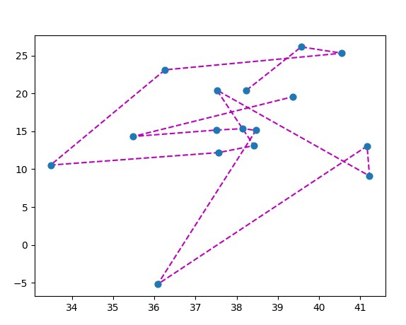

TSPLIB-python-parser
====================

[](https://www.python.org/downloads/release/python-360/)
[](https://GitHub.com/Naereen/StrapDown.js/graphs/commit-activity)
[](https://codecov.io/gh/tsartsaris/TSPLIB-python-parser)
[](https://www.gnu.org/licenses/gpl-3.0)

This is a parser to read 2D Symmetric traveling salesman problem STSP problems data into python dict

## How to use it
- command line 
```commandline
parser.py --file <filename> --plot true
```
- from python script 
```python 
TSPParser(filename="filename", plot_tsp=True)
```

## What it does

feed it with a file like

(***~~cheat~~***)
```commandline
NAME: ulysses16.tsp
TYPE: TSP
COMMENT: Odyssey of Ulysses (Groetschel/Padberg)
DIMENSION: 16
EDGE_WEIGHT_TYPE: GEO
DISPLAY_DATA_TYPE: COORD_DISPLAY
NODE_COORD_SECTION
 1 38.24 20.42
 2 39.57 26.15
 3 40.56 25.32
 4 36.26 23.12
 5 33.48 10.54
 6 37.56 12.19
 7 38.42 13.11
 8 37.52 20.44
 9 41.23 9.10
 10 41.17 13.05
 11 36.08 -5.21
 12 38.47 15.13
 13 38.15 15.35
 14 37.51 15.17
 15 35.49 14.32
 16 39.36 19.56
 EOF
``` 
 
you will end up having a dict like

```python 
{'1': (38.24, 20.42), '2': (39.57, 26.15),
'3': (40.56, 25.32), '4': (36.26, 23.12),
'5': (33.48, 10.54), '6': (37.56, 12.19),
'7': (38.42, 13.11), '8': (37.52, 20.44),
'9': (41.23, 9.1), '10': (41.17, 13.05),
'11': (36.08, -5.21), '12': (38.47, 15.13),
'13': (38.15, 15.35), '14': (37.51, 15.17),
'15': (35.49, 14.32), '16': (39.36, 19.56)}
 ```

***As an addon you plot the cities with matplotlib and the current route based on the order in the initial file***


